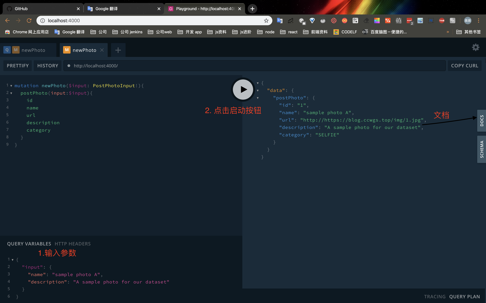

> 本文参考 [intro-to-graphql](https://slides.com/scotups/intro-to-graphql#/) 与 [grapQL 官网](https://graphql.cn/learn/) 记录一次学习 graphQL 之旅。[ 项目API地址](https://github.com/cc7gs/graphql-photo-api)。

> 在学习语法时候，可以点开 [Apollo playground](http://ccwgs.top/playground)进行实践。

# 目录

1. [什么是GraphQL?](#什么是GraphQL?)
2. [客户端](#客户端)
3. [服务端](#服务端)
4. [参考](#参考)
5. [资料](#资料)

# 什么是GraphQL?
- 新的API标准、它由Facebook 2015年开源
- 声明式数据获取、并能够准确获取描述中的数据
- 强类型(类似 typescript)
- GraphQL服务公开单个端点并相应查询
- 可以与任何编程语言和框架一起使用

## 与 REST对比优势
- 数据的关联性和结构化更好
- 实现订阅问题
- 适应快速产品迭代，无版本API
- 对于后端请求的数据有更细致的了解
- 强类型系统定义API的功能
- 前端后端可以根据Schema共同开发
- 强大的开发工具

>💡 要了解有关使用GraphQL的主要原因更多信息  [click this](https://www.prisma.io/blog/top-5-reasons-to-use-graphql-b60cfa683511)

##  基本语法
1. **字段**

```js
{
  me{
    name
    avatar
    githubLogin
    inPhotos{
      name
      description
    }
  }
}

```
2. **参数**
```js
{
  User(login:4){
    name
    avatar
  }
}
```
3. **字段别名**
```js
{
  User(login:4){
    userName: name
    avatar
  }
}
```
返回结果如下:
```js
{
  "data": {
    "User": {
      "userName": "هستی نجاتی",
      "avatar":"https://randomuser.me/api/portraits/thumb/women/50.jpg"
    }
  }
}
```
4. **片段**

片段允许重复使用常见的字段，从而减少了文档中的重复文本

```js
Query noFragments{
  me{
    name
    avatar
    githubLogin
    inPhotos{
      name
      description
	  postedBy{
          name
          avatar
          githubLogin
        }
    }
  }
}
```
使用 片段进行优化查询:
```js
Query withFragments{
  me{
	...userInfo 
    inPhotos{
      name
      description
	  postedBy{
         ...userInfo 
        }
    }
  }
}
fragment userInfo on User{
      name
      avatar
      githubLogin
}
```

5.  变量
	1. 使用 `$userID`代替查询中的静态值
	2. 将 `$userID`传递给要查询的值
	3. 将 `userID` 作为请求体提交查询

```js
query getUser($userID:ID!){
  User(login:$userID){
    userName:name
  }
}
```


6. 指令

GraphQL 核心规范中目前包含两个指令:

- @include(if: Boolean) 仅在参数为 true 时，包含此字段。
- @skip(if: Boolean) 如果参数为 true，跳过此字段。


8. 变更
```js
mutation addUser{
  addFakeUsers(count:1){
    githubLogin
  }
}
```
### 查询与变更
### schema与类型
schema是类型的集合,类型表示自定义对象，它是用于描述从服务端查询到的数据。
为了方便定义类型，GraphQL引入了模版定义语言(Schema Definition Language,SDL)。它和 GraphQL 的查询语言很相似，让我们能够和 GraphQL schema 之间可以无语言差异地沟通。

1. GraphQL内置的标量类型

- Int：有符号 32 位整数。
- Float：有符号双精度浮点值。
- String：UTF‐8 字符序列。
- Boolean：true 或者 false。
- ID：ID 标量类型表示一个唯一标识符，通常用以重新获取对象或者作为缓存中的键。ID 类型使用和 String 一样的方式序列化；然而将其定义为 ID 意味着并不需要人类可读型。
  
```js
type Photo {
  id: ID!
  url: String!
  name: String!
  description: String
  category: PhotoCategory! # 枚举类型
}
```
2. 枚举类型

```js
enum PhotoCategory {
  SELFIE
  PORTRAIT
  ACTION
  LANDSCAPE
  GRAPHIC
}
```
3. 自定义类型
```js
scalar DateTime

type Photo{
    ...
    created: DateTime!
}
```
也可以采用[graphql-custom-types]库,其中包含了很多自定义类型。

[构建自定义类型](https://ccwgs.blog.csdn.net/article/details/103714267)

4. 列表
列表通过使用方括号包裹GraphQL类型创建。

```js
type User{
  githubLogin: ID!
  name: String
  avatar: String
  postedPhotos:[Photo!]!
  inPhotos:[Photo!]!
}
```
|列表声明|定义|无效实例|
|---|---|---|
|[Int]| 可空的整数值列表 |非整数 |
|[Int!]| 不可空的整数值列表 |[1,null] |
|[Int]!| 可空的整数值非空列表 | null |
|[Int!]!| 不可空的整数值非空列表 |null、[null] |

5. 联合类型

和TS类似,它也是用来返回几种不同类型之一。

```js
union AgendaItem=StudyGroup| Workout
type StudyGroup{
    name: String!
    subject: String!
    students: [User!]!
}
type Workout {
    name:String!
    reps:Int!
}
type Query{
    agenda:[AgendaItem!]!
}
```
书写查询语句如下:
```js
query schedule{
    agenda{
        ...on Workout{
            name
        }
        ...on StudyGroup{
            name
            subject
            students
        }
    }
}

```

6. 接口
接口是一种抽象类型,它可以由对象类型实现。接口规范了Schema中的代码,确保了某些类型总是包含特定字段，无论它返回什么类型这些字段都是可查询的。
```js
scalar DataTime

interface AgendaItem{
    name: String!
    start: DateTime!
    end: DateTime! 
}

type StudyGroup implements AgendaItem{
    name: String!
    start: DateTime!
    end: DateTime! 
    topic: String
}

type Workout implements AgendaItem{
    name: String!
    start: DateTime!
    end: DateTime! 
    reps: Int!
}
```

7. 参数
通过loginId 查询某一个用户信息。
```js
type Query{
  User(login:ID!):User
}
```
8. 输入类型
输入类型与GraphQL对象类型很相似,不过它仅仅是用于输入参数和规范输入参数。

```js
input PostPhotoInput {
  name: String!
  category: PhotoCategory = SELFIE
  description: String
}
type Mutation {
    postPhoto(input: PostPhotoInput!): Photo!
}
```

9.  返回类型
比如我们要使用gitHub授权(GitHub OAuth)登录时,当发送有效授权码进行身份验证。如果成功，我们将返回一个自定义类型该类型包含登录用户信息、以及token。
```js
type AuthPayload {
  token: String!
  user: User!
}

type Mutation{
    githubAuth(code:String!):AuthPayload!
}
```
10. 订阅类型
我们添加一种订阅类型,通过它用户可以创建新的Photo或User类型。当发布照片时，新照片将推送给所有已订阅newPhoto的用户。

```js
type Subscription {
    newPhoto:Photo!
    newUser: User!
}
```
11. 查询与变更
```js
type Query{
    ...
}
type Mutation{
    ...
}
```

# 客户端
使用 GraphQL Client 可以让我们专注于业务不用去关心网络请求、缓存等功能。

目前有两个主要的GraphQL客户端:
1. [Apollo Client](https://www.apollographql.com/docs/react/):
它是由社区驱动开发，以处理缓存，更新UI等为目标构建客户端解决方案,目前包含React、Vue、Angular、ios和安卓系统的客户端包。
2. [Relay](https://facebook.github.io/relay/):是 Facebook在2015年开源。它囊括了生产中使用GraphQL所获得的一切，但是它仅兼容React和React-Native。

本文采用`Apollo Client React`构建应用，起步流程参考[官网](https://www.apollographql.com/docs/react/get-started/)

下面实现一个简单查询demo构建查询基本流程:

1. 创建 应用 引入依赖
> npx create-react-app  photo-client --typescript

> npm i @apollo/client  graphql react-router-dom  @types/react-router-dom

Apollo Client核心包分为:
 - `@apollo/client` - 核心包集成了 React-hooks
 - `@apollo/react-components` - React Apollo render Props 渲染组件 
 -  `@apollo/react-hoc`: - React Apollo HOC API(已经废弃)

如果你只想用Hooks，那么只安装  `@apollo/client`即可

2. 配置 client
```js
//index.tsx

import React from 'react'
import { render } from 'react-dom'
import { ApolloClient, HttpLink, InMemoryCache, ApolloProvider } from '@apollo/client';
import App from './App'

const client = new ApolloClient({
    cache: new InMemoryCache(),
    link: new HttpLink({
        uri: 'http://ccwgs.top/graphql'
    })
})

render(
    <ApolloProvider client={client}>
      <App />
    </ApolloProvider>, 
    document.getElementById('root')
)
```
3. 书写查询语句
```js
//app.tsx

import React from 'react';
import { BrowserRouter } from 'react-router-dom'
import { gql } from '@apollo/client';
import Users from './User'

export const ROOT_QUERT = gql`
 query userList{
   totalUsers
   allUsers{...userInfo}
   me{ ...userInfo}
 }
 fragment userInfo on User{
   githubLogin
   name
   avatar
 }
`
const App = () => (
  <BrowserRouter>
    <Users />
  </BrowserRouter>
)
export default App;
```
4. 引入查询组件
```js
//user.tsx

import React from 'react'
import { useQuery } from '@apollo/client'
import { ROOT_QUERT } from './App'

const Users = () => {
    const { loading, error, data, refetch } = useQuery(ROOT_QUERT);
    if (error) return <>`Error! ${error}`</>
    if (loading) { return <p>loading users ...</p> }
    return (
        <>
            <h2>总共 ${data.totalUsers}人</h2>
            {data.me && }
            {
                data.allUsers.map((user:any) => <h3>{user.name}</h3>)
            }
            <button onClick={() => refetch()}>Refetch!</button>
        </>)
}

```

**[回到顶部](#目录)**

# 服务端
## 搭建 Server API 环境
> npm i apollo-server 
> npm i typescript ts-node-dev -D

`package.json`

```js
  "scripts": {
    "dev": "ts-node-dev --respawn --transpileOnly ./src/index.ts",
  },
```

```js
import {ApolloServer} from 'apollo-server'

const typeDefs=`
    enum PhotoCategory {
        SELFIE
        PORTRAIT
        ACTION
        LANDSCAPE
        GRAPHIC
    }

    type Photo {
        id: ID!
        url: String!
        name: String!
        description: String
        category: PhotoCategory!
    }

    type Query{
        totalPhotos:Int!
        allPhotos: [Photo!]!
    }

    input PostPhotoInput {
        name: String!
        category: PhotoCategory=SELFIE
        description: String
    }

    type Mutation {
        postPhoto(input: PostPhotoInput!):Photo!
    }
`;
//_id 模拟数据自增ID
let _id=0;
const photos=[];

const resolvers={
    Photo:{
        url:parent=>`http://https://blog.ccwgs.top/img/${parent.id}.jpg`
    },
    Query:{
        totalPhotos:()=>photos.length,
        allPhotos:()=>photos
    },
    Mutation:{
        postPhoto(_,args){
            const newPhoto={
                id:_id++,
                ...args.input
            };
            photos.push(newPhoto);
            return newPhoto;
        }
    }
}
const server=new ApolloServer({
    typeDefs,
    resolvers
});

//开启服务监听 默认4000端口
server
    .listen()
    .then(({url})=>console.log(`GraphQL Service running on ${url}`))

```
> npm start
> 打开 连接 http://localhost:4000



喜欢ts伙伴可以查看👉[使用 node+typescript 搭建 GraphQL API](https://ccwgs.blog.csdn.net/article/details/103701560)

**[回到顶部](#目录)**

## 服务端开发
基于上面环境搭建将 `apollo-server`更换`apollo-server-express`

> npm i apollo-server-express graphql express  mongoose ncp dotenv node-fetch
> npm i typescript ts-node-dev -D

`package.json`

```js
  "scripts": {
    "build": "tsc && ncp src/schema  dist/schema ",
    "clear": "rimraf dist/",
    "start": "npm run clear && npm run build && node  ./dist/index.js"
  },
```
构建结构
```
src
├── index.ts    //入口
├── lib         //工具库
│   └── index.ts  
├── resolvers   //解析器
│   ├── Mutation.ts
│   ├── Query.ts
│   ├── Type.ts
│   ├── index.ts
│   └── types.ts
└── schema      
    └── typeDefs.graphql
```

重写构建服务如下:
```js
import * as express from 'express'
import { ApolloServer } from 'apollo-server-express'
import expressPlayground from 'graphql-playground-middleware-express'
import * as mongoose from 'mongoose'
import * as path from 'path'
import resolvers from './resolvers'
import { readFileSync } from 'fs'

const typeDefs = readFileSync(path.resolve(__dirname, './schema/typeDefs.graphql'), 'UTF-8');


async function start() {
    const app = express();
    const server = new ApolloServer({
        typeDefs,
        resolvers,
        context
    })

    server.applyMiddleware({ app });

    app.get('/', (req, res) => {
        res.send('Welcome to the PhotoShare API');
    })

    app.get('/playground', expressPlayground({ endpoint: '/graphql' }))

    app.listen({ port: 4000 }, () => {
        console.log(`GraphQL server running @ http://localhost:4000${server.graphqlPath}`)
    })

}

start()

```

### 连接数据库
[mongodb安装与使用](https://blog.csdn.net/qq_37674616/article/details/86680680)

1. 创建.env文件
```
DB_HOST=mongodb://localhost:27017/<Your-DataBase-Name>
```
2. 连接数据库并创建上下文
```js
require('dotenv').config()
function start(){
// ....
//  const app = express();
 const MONGO_DB = process.env.DB_HOST;
    let db;

    try {
       const client= await mongoose.connect(MONGO_DB!,
            { useNewUrlParser: true }
        )
        
       db=client.connection.db
    } catch (error) {
        console.log(`
    
        Mongo DB Host not found!
        please add DB_HOST environment variable to .env file
        exiting...
         
      `)
        process.exit(1)
    }
    const context = { db }; //创建上下文
    const server = new ApolloServer({
        typeDefs,
        resolvers,
        context
    })
 //...
}

```
### 修改解析器(从数据库中获取数据)

shema如下：
```js
type Query{
    totalPhotos:Int!
    allPhotos: [Photo!]!
}
```

```js
//resolves/Query.ts

const totalPhotos:Fn=(_,arg,{db})=>
    db.collection('photos')
    .estimatedDocumentCount()

const allPhotos:Fn=(parent,args,{db})=>
    db.collection('photos')
    .estimatedDocumentCount()

```
### github OAuth

[OAuth 介绍与使用](https://blog.csdn.net/qq_37674616/article/details/99496916)

1. 构建请求函数

```js
//lib/index.ts

import  fetch from 'node-fetch'

type ReqGithub={
    client_id:string;
    client_secret:String;
    code:String;
}

const requestGithubToken=(credentials:ReqGithub)=>
fetch(
    'https://github.com/login/oauth/access_token',
    {
        method:'POST',
        headers:{
            'Content-Type':'application/json',
            Accept:'application/json'
        },
        body:JSON.stringify(credentials)
    }
).then(res=>res.json())

const requestGithubUserAccount=(token:string)=>
fetch(`https://api.github.com/user?access_token=${token}`)
.then(res => res.json())

export const authorizeWithGithub=async(credentials:ReqGithub)=>{
    const {access_token}=await requestGithubToken(credentials);
    const githubUser=await requestGithubUserAccount(access_token);
    return {...githubUser,access_token}
}
```
2. 创建shema
```js
//schema/typeDefs.graphql

type AuthPayload {
  token: String!
  user: User!
}
type Mutation {
    ...
    githubAuth(code:String!):AuthPayload!
}
```
3. 构建解析器

```js
//resolvers/Mutation.ts

const githubAuth:Fn=async(parent,{code},{db})=>{

 let {
    message,
    access_token,
    avatar_url,
    login,
    name
  } = await authorizeWithGithub({
    client_id: process.env.CLIENT_ID!,
    client_secret: process.env.CLIENT_SECRET!,
    code
  });

  if(message){
      throw new Error(message)
  }

  let latestUserInfo={
      name,
      githubLogin:login,
      githubToken:access_token,
      avatar:avatar_url
  }
  const {ops:[user]}=await db
  .collection('users')
  .replaceOne({githubLogin:login},latestUserInfo,{upsert:true})

  return {user,token:access_token}
}
```
1. 测试

> https://github.com/login/oauth/authorize?client_id=**&scope=user

github 重定向地址
http://localhost:3000/oauth?code=***

```js
mutation github{
  githubAuth(code: "***"){
    token
    user{
      githubLogin
      name
      avatar
    }
  }
}
```
#### 根解析器解析token
我们通过根解析器解析token返回用户信息,如果无效则返回null。
```js
//src/index.ts

   // const context = { db };
    const server = new ApolloServer({
        typeDefs,
        resolvers,
        context: async({req})=>{
            const githubToken=req.headers.authorization;
            const currentUser=await db.collection('users').findOne({githubToken})
            return {db,currentUser}
        }
    })
```
```js
//schema/typeDefs.graphql

type Query {
  me:User
}
```

```js
//resovles/Query.ts

const me:Fn=(_,args,{currentUser})=> currentUser
```
测试
```js
query getCurrentUser{
  me{
    githubLogin
    name
    avatar
  }
}
```
该仓库为学习分支，了解更多内容[点击该仓库](https://github.com/cc7gs/frontEnd_note/tree/master/basic/nodejs-basic/framework)

### 订阅
Apollo Server 自身已经支持订阅。默认情况下在 ws://localhost:4000 下设置 WebSocket。本文使用Apollo-server-express, 其自身不包含订阅要进行配置如下:

修改 `src/index.ts` start 函数如下
```js
// src/index.ts

import  {createServer} from 'http'

server.applyMiddleware({ app });
const httpServer=createServer(app);
server.installSubscriptionHandlers(httpServer)

httpServer.listen({ port: 5000 }, () => {
    console.log(`GraphQL server running @ http://localhost:5000${server.graphqlPath}`)
})
```
1. 书写 schema
```js
type Subscription {
  newPhoto: Photo!
}
```
2. 在新增照片时发布给已订阅
```js
// resolvers/Mutation.ts
const postPhoto:Fn=async(parent,args,{db,pubsub,currentUser})=>{

    //...
  const {insertedIds}=await db.collection('photos').insert(newPhoto)
  newPhoto.id=insertedIds[0] 
  
  //发布
  pubsub.publish('photo-added', { newPhoto })

  return newPhoto
}
```
3. 订阅解析器

```js
// resolvers/Subscription.ts
module.exports = {
    newPhoto: {
        subscribe: (parent:any, args:any, { pubsub }:any) => pubsub.asyncIterator('photo-added')
    },
}
```
4. 新增`pubsub`实例

```js
//src/index.ts
import { ApolloServer,PubSub } from 'apollo-server-express'

async function start() {
    const pubsub=new PubSub();
    const server = new ApolloServer({
        typeDefs,
        resolvers,
        context: async ({ req }) => {
            const githubToken = req.headers.authorization;
            
            const currentUser = await db.collection('users').findOne({ githubToken })
            return { db, currentUser,pubsub }
        }
        })
}
```

### 安全方面
一个应用可靠性一定是排在第一位的，那么如果提高GraphQL Server安全，可以考虑如下方面:
#### 超时
第一个简单策略就是设置超时来防御大型查询。

下面我们添加一个五秒超时时间:
```js
import {createServer} from 'http'

const httpServer=createServer(app);
httpServer.timeout=5000;

```
接下来我们将查询开始时间传入上下文,之后所有解析器都知道开始时间，如果超过时长则抛出错误。
```js
const context=async ({})=>{
	//...
	return {
  		timestamp:performance.now()
  	}
}
```
#### 设置查询深度
有时候客户端滥用查询，写出如下查询
```js
query IAmEvil {
  author(id: "abc") {
    posts {
      author {
        posts {
          author {
            posts {
              author {
                # that could go on as deep as the client wants!
              }
            }
          }
        }
      }
    }
  }
}
```
此时我们可以使用`graphql-ruby`、`graphql-depth-limit`等库来设置深度限制。
```js
import depthLimit from 'graphql-depth-limit'
 ...
    const server = new ApolloServer({
       typeDefs,
       resolvers,
       validationRules:[depthLimit(5)],
       context: async ({ req }) => {
       ...
      }
     })
```
**优点:**
- 文档AST是静态分析,因此该查询不会被执行因此也不会给服务端带来压力

**缺点:**
-  只用深度限制不能阻止所有滥用查询情况，一般要结合复杂度。
#### 查询复杂度
有时候客户端查询深度并不高，但是查询字段的数量庞大，性能也会造成浪费。
例如下面实例，查询深度不高，但是数据量特别大，由于每个字段映射都会调用解析器函数 因此非常耗费性能。

```js
Query everthing ($id:ID!){
   totalUsers
   photo(id:$id){
		name
	}
	allUsers{
		id,
		name,
		postedPhotos{
			name
		}
		taggedUsers{
			id,
			name
		}
	}
}
```
GraphQL对于复杂度校验中有个默认规则，每个标量字符赋值为1，如果该字段返回列表则乘以10.
```js
Query everthing ($id:ID!){
   totalUsers  // complexity 1
   photo(id:$id){
		name   // complexity 1
	}
	allUsers{
		id,  // complexity 10
		name,  // complexity 10
		postedPhotos{
			name   // complexity 100
		}
		taggedUsers{
			id,  // complexity 100
			name  // complexity 100
		}
	}
}     // total complexity 322
```
下面我们可以借助量类似`graphql-validation-complexity`等库来解决。

**[回到顶部](#目录)**

# 其它
1. 如果接口通过 Nginx部署时,注意要开通WS(webSocket),配置大致如下:
```
#websocket配置
map $http_upgrade $connection_upgrade {
            default upgrade;
            '' close;
}
upstream graphqlPhotoApi {
        server 127.0.0.1:4000;
}

server {
      listen 80;
      server_name  ccwgs.top; 
     location / {
            proxy_http_version 1.1;
            proxy_pass http://graphqlPhotoApi;
            
           #配置Nginx支持webSocket开始
            proxy_set_header Host $http_host;  
            proxy_set_header Upgrade $http_upgrade;
            proxy_set_header Connection "upgrade";
             proxy_redirect off;
   }
    
} 
```
2.  Apollo express server 2.0后不用集成 `graphql-playground-middleware-express`
```js
import { ApolloServer,PubSub,gql } from 'apollo-server-express'
import  {createServer} from 'http'
function start(){
  ...
    const pubsub=new PubSub();
    const server = new ApolloServer({
        typeDefs,
        resolvers,
        context: async ({ req,connection }) => {
          const githubToken = req?req.headers.authorization:connection!.context.Authorization;
          
          const currentUser = await db.collection('users').findOne({ githubToken })
          return { db, currentUser,pubsub }
        },
        subscriptions:{path:'/graphql'}
      })

    server.applyMiddleware({ app,path:'/graphql' });
    const httpServer=createServer(app);
    server.installSubscriptionHandlers(httpServer)
    
      httpServer.listen({ port: 4000 }, () => {
        console.log(`GraphQL server running @ http://localhost:4000${server.graphqlPath}`)
        console.log(`🚀 Subscriptions ready at ws://localhost:4000${server.subscriptionsPath}`)
    })
 }
```

# 参考

[How TO GraphQL](https://www.howtographql.com/)

[intro-to-graphql](https://slides.com/scotups/intro-to-graphql#/)

[grapQL 官网](https://graphql.cn/learn/)


# 资料
[randomuser](https://randomuser.me/): 生成mock user数据

[graphQL playground](https://www.graphqlbin.com/)

[graphiQL](https://github.com/graphql/graphiql)

[graqhQL公共接口](https://github.com/APIs-guru/graphql-apis)

[Snowtooth](http://snowtooth.moonhighway.com/)
